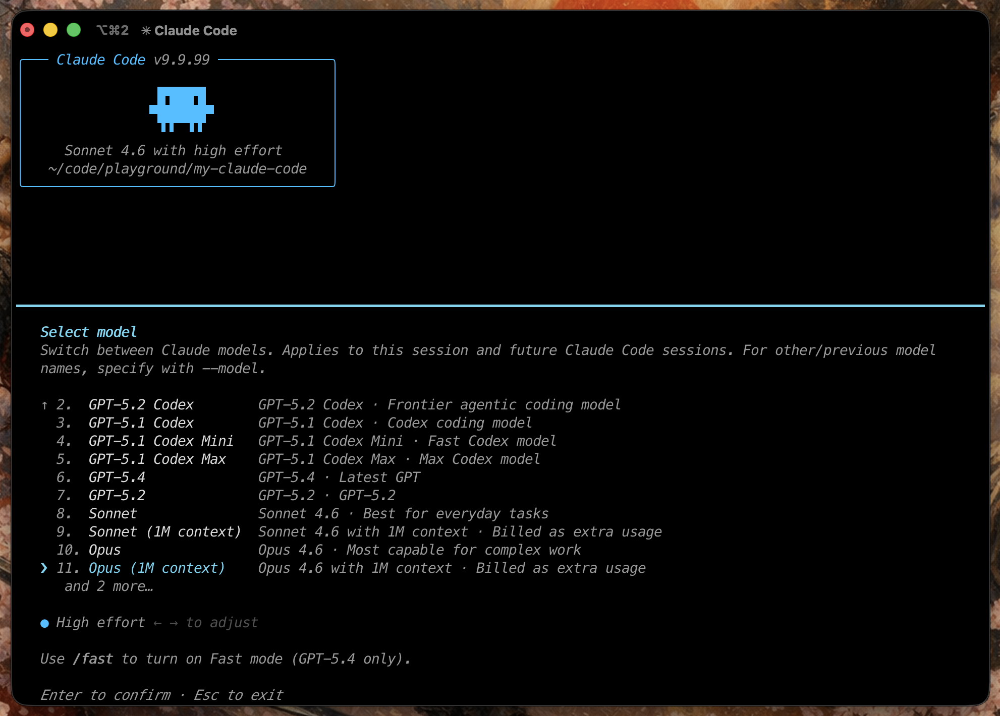

<h1 align="center">my-claude-code</h1>

<p align="center">
  Private internal fork and build workspace for a modified Claude Code CLI snapshot.
</p>

<p align="center">
  
</p>

---

## Table of Contents

- [What This Repository Is](#what-this-repository-is)
- [Current Status](#current-status)
- [Quick Start](#quick-start)
- [Authentication and Providers](#authentication-and-providers)
- [Build and Run](#build-and-run)
- [Feature Flags and Supporting Docs](#feature-flags-and-supporting-docs)
- [Project Structure](#project-structure)
- [Collaboration](#collaboration)
- [License and Risk Notice](#license-and-risk-notice)

---

## What This Repository Is

`my-claude-code` is a private working fork of Anthropic's Claude Code CLI snapshot, maintained as an internal repo for personal use and invited collaborators.

This fork is focused on three practical changes:

- telemetry-related behavior is removed or stubbed where possible
- prompt-layer restrictions added by the CLI wrapper are reduced
- build-time experimental feature flags are exposed for local builds and testing

This README is written for people who already have access to this repository. It is not a public release page.

---

## Current Status

- Repository visibility: private
- Primary audience: repo owner and invited collaborators
- Main workflow: clone locally, install dependencies, build the CLI, then authenticate for the provider you want to use
- Supporting technical notes live in [FEATURES.md](FEATURES.md), [AGENTS.md](AGENTS.md), [CLAUDE.md](CLAUDE.md), and [changes.md](changes.md)

---

## Quick Start

### Option 1: Clone and build locally

This is the main supported path and does not depend on raw GitHub access.

```bash
git clone git@github.com:Icarus603/my-claude-code.git
cd my-claude-code
bun install
bun run build
./dist/cli.js
```

### Option 2: One-line installer

The installer only works for accounts that already have access to this private repository.

```bash
curl -fsSL https://raw.githubusercontent.com/Icarus603/my-claude-code/main/install.sh | bash
```

The installer checks your system, installs Bun if needed, clones the repo, builds `dist/cli.js`, and symlinks `my-claude-code` into `~/.local/bin`.

---

## Authentication and Providers

This repo supports multiple providers, but they do not all authenticate the same way.

### Anthropic

Use Anthropic directly with either:

- `ANTHROPIC_API_KEY`
- `/login` for Anthropic OAuth

```bash
export ANTHROPIC_API_KEY="..."
./dist/cli.js
```

### OpenAI Codex

Codex uses OpenAI OAuth through the CLI. Set the provider flag first, then run `/login`.

```bash
./dist/cli.js
```

Inside the CLI:

```text
/login
```

Then choose the Codex login flow.

After a successful Codex login, this fork now persists `CLAUDE_CODE_USE_OPENAI=1`
in your user config automatically, so new terminal tabs will continue using
OpenAI Codex without needing another manual `export`.

Supported model examples:

| Model | ID |
|---|---|
| GPT-5.3 Codex | `gpt-5.3-codex` |
| GPT-5.4 | `gpt-5.4` |
| GPT-5.4 Mini | `gpt-5.4-mini` |

### AWS Bedrock

Bedrock does not use `/login`. It uses AWS credentials plus provider flags.

```bash
export CLAUDE_CODE_USE_BEDROCK=1
export AWS_REGION="us-east-1"
./dist/cli.js
```

### Google Vertex AI

Vertex does not use `/login`. It uses Google Cloud credentials.

```bash
gcloud auth application-default login
export CLAUDE_CODE_USE_VERTEX=1
./dist/cli.js
```

### Anthropic Foundry

Foundry does not use `/login`. It uses explicit environment configuration.

```bash
export CLAUDE_CODE_USE_FOUNDRY=1
export ANTHROPIC_FOUNDRY_API_KEY="..."
./dist/cli.js
```

### Provider Summary

| Provider | Selection | Authentication |
|---|---|---|
| Anthropic | default | `ANTHROPIC_API_KEY` or Anthropic `/login` |
| OpenAI Codex | default after Codex login | OpenAI `/login` |
| AWS Bedrock | `CLAUDE_CODE_USE_BEDROCK=1` | AWS credentials |
| Google Vertex AI | `CLAUDE_CODE_USE_VERTEX=1` | Google ADC |
| Anthropic Foundry | `CLAUDE_CODE_USE_FOUNDRY=1` | `ANTHROPIC_FOUNDRY_API_KEY` |

---

## Build and Run

### Requirements

- Bun `>= 1.3.11`
- macOS or Linux
- valid credentials for whichever provider you plan to use

Install Bun if needed:

```bash
curl -fsSL https://bun.sh/install | bash
```

### Standard build

```bash
bun install
bun run build
./dist/cli.js
```

### Build output

| Command | Output | Notes |
|---|---|---|
| `bun run build` | `./dist/cli.js` | the only supported compiled build |
| `bun run dev` | source execution | slower startup, no standalone binary |

### Common usage

```bash
# interactive mode
./dist/cli.js

# one-shot prompt
./dist/cli.js -p "what files are in this directory?"

# choose a model explicitly
./dist/cli.js --model claude-opus-4-6

# start Codex mode
./dist/cli.js
```

### Selected environment variables

| Variable | Purpose |
|---|---|
| `ANTHROPIC_API_KEY` | Anthropic API key |
| `ANTHROPIC_AUTH_TOKEN` | alternative Anthropic auth token |
| `ANTHROPIC_MODEL` | override default Anthropic model |
| `ANTHROPIC_BASE_URL` | custom Anthropic-compatible endpoint |
| `CLAUDE_CODE_USE_OPENAI` | manually force OpenAI Codex backend |
| `CLAUDE_CODE_USE_BEDROCK` | switch to AWS Bedrock |
| `CLAUDE_CODE_USE_VERTEX` | switch to Google Vertex AI |
| `CLAUDE_CODE_USE_FOUNDRY` | switch to Anthropic Foundry |
| `CLAUDE_CODE_OAUTH_TOKEN` | OAuth token provided via environment |

---

## Feature Flags and Supporting Docs

- [FEATURES.md](FEATURES.md): technical audit of compile-time feature flags in this snapshot
- [AGENTS.md](AGENTS.md): Codex-oriented repo guidance for coding agents
- [CLAUDE.md](CLAUDE.md): Claude-oriented repo guidance for coding agents
- [changes.md](changes.md): one-off development notes for the Codex integration work

The default build already includes this repo's current working feature bundle:

```bash
bun run build
./dist/cli.js
```

To enable specific flags manually:

```bash
bun run ./scripts/build.ts --feature=ULTRAPLAN --feature=ULTRATHINK
```

---

## Project Structure

```text
scripts/
  build.ts                build script and feature flag bundler

src/
  entrypoints/cli.tsx     CLI entrypoint
  commands.ts             slash command registry
  tools.ts                tool registry
  QueryEngine.ts          message and tool orchestration

  commands/               slash command implementations
  tools/                  tool implementations
  components/             Ink/React terminal UI
  hooks/                  React hooks
  services/               API, OAuth, MCP, analytics integrations
  state/                  application state
  skills/                 skill system
  plugins/                plugin system
  bridge/                 IDE bridge
  voice/                  voice support
  tasks/                  background task management
```

---

## Collaboration

This repository is not set up like a public open source project.

If you already have write access:

1. Create a branch from `main`.
2. Make and validate your changes locally.
3. Push your branch to this repository.
4. Open a pull request against `main`.

If you do not have access, do not assume the public fork-and-PR workflow applies here.

If you are working on feature restoration, read [FEATURES.md](FEATURES.md) first because it contains the current compile status and caveats for many flags.

---

## License and Risk Notice

This repository does not currently include a standalone `LICENSE` file, and this README should not be read as granting one.

The upstream Claude Code source and related rights belong to Anthropic. This repo is maintained as a private internal workspace around a source snapshot and related modifications. Use, sharing, and redistribution should be treated as restricted unless and until an explicit license is added.
